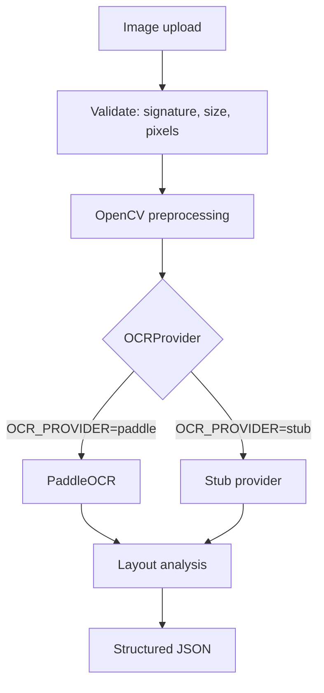

# Document OCR Service

A self-hosted OCR microservice. Upload an image over HTTP, get back structured
text with per-line geometry, reading order and confidence scores. It runs
entirely on open-source components — no paid OCR API, no cloud service, no
outbound calls once the models are cached — so it can sit inside your own
infrastructure and be called from any backend.

It also ships a standalone ICAO 9303 machine-readable-zone (MRZ) parser for
passports and travel documents, usable as a plain Python library independently
of the HTTP service.


> **Engine status.** The generic OCR infrastructure and the MRZ parser are
> covered by tests. PaddleOCR package initialization was verified, but
> inference is environment-dependent and must be validated on the target Linux
> server. The service ships a `stub` provider so the whole API, pipeline and
> test-suite run without loading any model; switching to the real engine is one
> line in `.env`.

---

## Table of contents

1. [Why?](#why)
2. [Features](#features)
3. [Architecture](#architecture)
4. [Quick start](#quick-start)
5. [API](#api)
6. [cURL examples](#curl-examples)
7. [Laravel / PHP integration](#laravel--php-integration)
8. [Python integration](#python-integration)
9. [Passport / MRZ parser](#passport--mrz-parser)
10. [Deployment](#deployment)
11. [CI / CD](#ci--cd)
12. [Configuration](#configuration)
13. [Performance and concurrency](#performance-and-concurrency)
14. [Security and privacy](#security-and-privacy)
15. [Testing](#testing)
16. [Project structure](#project-structure)
17. [Extending the OCR engine](#extending-the-ocr-engine)
18. [Production deployment guide (detailed)](#production-deployment-ubuntu-2204--2404-no-docker)
19. [Troubleshooting](#troubleshooting)
20. [Roadmap](#roadmap)
21. [Contributing](#contributing)
22. [License](#license)
23. [FAQ](#faq)
---

## Why?

Most OCR options push you toward a metered cloud API. That is a problem when
the documents are invoices, contracts, identity papers or anything else you
would rather not send to a third party — and it is a recurring cost that scales
with your traffic.

This project exists to make OCR an ordinary internal HTTP service:

- **Self-hosted.** Runs on your own VPS. After the models are cached, no
  outbound network calls are needed.
- **No paid OCR API.** PaddleOCR and OpenCV, both open source.
- **Arabic and English**, including mixed-script pages.
- **Callable from any backend.** It is an HTTP API with an API key, so Laravel,
  Django, Rails, Node or a cron job can all use it the same way.
- **The OCR engine is swappable.** Application code depends on an
  `OCRProvider` interface, not on PaddleOCR. A `stub` provider lets you develop
  and test the whole service without downloading a single model.

It is deliberately a *service*, not a library to embed: OCR is CPU- and
memory-hungry, and keeping it in a separate process means your application
stays responsive and can be scaled independently.

---

## Features

### OCR

| | |
|---|---|
| Languages | English and Arabic, configurable per request |
| Mixed script | Arabic and Latin on the same line are handled |
| Reading order | Boxes are grouped into lines and ordered top-to-bottom |
| RTL | Right-to-left lines are ordered right-to-left |
| Geometry | Per-block 4-point polygon and axis-aligned bounding box |
| Confidence | Per block, per line, and a page-level mean/min/max |
| Regions | Optional paragraph-like grouping of adjacent lines |
| Preprocessing | Perspective correction, downscale, deskew, contrast enhancement |
| Orientation | Retries other page rotations when the first pass finds almost nothing |
| Filtering | `min_confidence` drops low-scoring boxes, and reports how many |

The provider maps several other PaddleOCR language codes (`fr`, `german`, `es`,
`ru`, `ch`, `japan`, `korean`), but only English and Arabic are exercised by the
test-suite.

Recognition never fabricates text. An unreadable page returns `200` with empty
`text` and an explicit warning rather than a guess.

### Passport / MRZ

A standards-based parser for ICAO Doc 9303 machine-readable zones.

| | |
|---|---|
| Formats | TD1 (3×30), TD2 (2×36), TD3 (2×44), MRV-A, MRV-B |
| Validation | 7-3-1 check digits per field, plus the composite digit |
| Fields | document code and category, issuing state, document number, nationality, birth date, sex, expiry date, optional data, personal number, surname, given names |
| Per field | value, check-digit validity, confidence, and a list of errors |
| Dates | `YYMMDD` resolved to ISO `YYYY-MM-DD` with century resolution |
| Correction | Conservative, standards-driven OCR repair (see below) |
| Extended numbers | Document numbers longer than 9 characters recovered from the optional-data field |

> **The MRZ parser is standalone. It is *not* wired into
> `POST /api/v1/ocr`.** That endpoint returns generic OCR output only — no
> passport fields. To parse an MRZ today, call the library yourself with text
> lines you already have. See [Passport / MRZ parser](#passport--mrz-parser).

Correction is deliberately conservative: type coercion is applied only where
the standard fixes a field's type, and check-digit-guided repair is accepted
only when exactly one candidate validates. Where several candidates would
validate, the original text is kept and the ambiguity is reported.

### Production and security

Only protections that are actually implemented:

- API key authentication (`X-API-Key` or `Authorization: Bearer`), constant-time
  comparison, multiple keys for rotation
- Rate limiting per key, in-process or shared via Redis
- Upload size limit enforced twice: on `Content-Length` and while streaming
- Image type identified by **file signature**, not the client's `Content-Type`
- Extension allow-list and a pixel-count ceiling (decompression-bomb guard)
- Uploads processed in memory and discarded; nothing persisted unless
  `STORE_UPLOADS` is explicitly enabled
- Client filenames never used to name anything on disk
- Log redaction: recognised text, filenames and API keys never reach the logs
- No stack traces in HTTP responses
- Security headers (`nosniff`, `DENY`, `no-referrer`, `no-store`)
- systemd unit runs as a non-root user with a hardening profile
- Nginx reverse proxy; the application binds to loopback only

---

## Architecture

```
Client
  |
  v
Nginx  (TLS, rate limit, upload cap)
  |
  v
FastAPI  (API key, rate limit, request id)
  |
  v
OCR pipeline
  |
  +--> Image preprocessing   (OpenCV: perspective, downscale, deskew, enhance)
  |
  +--> OCR provider
  |       |
  |       +--> PaddleOCR     (production)
  |       +--> Stub          (development and tests, loads no model)
  |
  +--> Layout analysis       (lines, reading order, RTL, regions)
  |
  v
Structured JSON
```



### The provider abstraction

Nothing outside `app/services/ocr/` knows that PaddleOCR exists. The pipeline
depends on `OCRProvider`, `OCRResult` and `TextBlock`. Two consequences matter
in practice:

- **Development needs no models.** `OCR_PROVIDER=stub` runs the entire service.
  The test-suite asserts, in a subprocess, that this path never imports
  `paddle`, `paddleocr` or `paddlex` at all.
- **Adding an engine is additive.** Implement the interface, register it, set
  `OCR_PROVIDER`. No API, schema or pipeline changes. See
  [Extending the OCR engine](#extending-the-ocr-engine).

Models are loaded **once per worker process** at application startup and reused
for every request — never per request.

---

## Quick start

Requires Python 3.9+ (3.11+ recommended). Verified on macOS arm64 and targeted
at Ubuntu 22.04/24.04.

### 1. Development, no models (fastest path)

```bash
git clone <your-repo-url> ocr && cd ocr
DEV=1 ./scripts/setup.sh          # creates .venv, installs deps, writes .env with a generated key
```

`scripts/setup.sh` generates an API key into `.env`. Then start with the stub
provider:

```bash
OCR_PROVIDER=stub ./scripts/run.sh
```

In another terminal:

```bash
./scripts/smoke.sh
```

> **What the stub does.** It returns only text a test explicitly scripted into
> it, and nothing otherwise. Against a real image it returns empty `text` with
> a `"no text was recognised in the image"` warning. That is intentional — it
> never invents output. Use it to exercise the API, auth, limits and your own
> client integration; use `paddle` to actually read images.

### 2. Real OCR with PaddleOCR

```bash
# in .env
OCR_PROVIDER=paddle
OCR_LANGUAGES=en,arabic
```

```bash
./scripts/run.sh
```

**First run downloads models.** PaddleOCR fetches detection and recognition
models into `~/.paddlex/official_models` (or `PADDLE_PDX_CACHE_HOME`) the first
time each language is used — roughly 230 MB for English plus Arabic on the
configuration this project was developed against. That first start needs
network access and can take several minutes; subsequent starts are fast and
offline.

Pre-download without starting the server:

```bash
.venv/bin/python -c "
from app.services.ocr.registry import create_provider
create_provider('paddle').warmup(['en', 'arabic'])
"
```

PaddlePaddle wheel availability varies by platform and Python version. If the
engine will not install or run on your machine, keep `OCR_PROVIDER=stub` for
development and validate `paddle` on your Linux server — see
[Troubleshooting](#troubleshooting).

### Scripts

| Script | Purpose |
|---|---|
| `./scripts/setup.sh` | Create the virtualenv, install dependencies, seed `.env`. `DEV=1` also installs test dependencies. |
| `./scripts/run.sh` | Start the service. `--reload` for development. |
| `./scripts/test.sh` | Run the test suite. Arguments pass through to pytest. |
| `./scripts/smoke.sh` | End-to-end check against a running instance. |

---

## API

Interactive docs are served at `/docs` when `DOCS_ENABLED=true` (the default in
`.env.example`; turn it off for public deployments).

### Authentication

Every call to `/api/v1/ocr` requires an API key. Either header works:

```
X-API-Key: <key>
Authorization: Bearer <key>
```

`/health`, `/ready` and `/api/v1/version` are unauthenticated.

If `OCR_API_KEY` is empty the service runs unauthenticated and logs a warning
at startup. Set it before exposing the service to anything.

### `POST /api/v1/ocr`

Recognise text in an image.

**Request** — `multipart/form-data` with a single file field:

| Field | Type | Notes |
|---|---|---|
| `image` | file | **Required.** JPEG, PNG, WebP, BMP or TIFF. |

**Query parameters** — all optional. These are **query-string** parameters, not
form fields; sending them in the multipart body has no effect.

| Parameter | Type | Default | Notes |
|---|---|---|---|
| `languages` | string | `OCR_LANGUAGES` | Comma separated, e.g. `en,arabic`. Aliases such as `ar` and `english` are accepted. |
| `preprocess` | bool | `true` | Run the OpenCV preprocessing chain. |
| `detect_orientation` | bool | config | Retry other page orientations when the first pass finds little text. |
| `include_blocks` | bool | `true` | Include every raw recognition box. |
| `include_regions` | bool | `false` | Include paragraph-like line groupings. |
| `min_confidence` | float | `0.0` | Drop boxes below this confidence (0.0–1.0). |

**Response `200`** — this is a real response body from the service:

```json
{
  "success": true,
  "request_id": "2321f684da7a43afbd956f090e6babc3",
  "text": "INVOICE 2026-09-01\nTOTAL 1240.00 USD",
  "languages": ["en", "arabic"],
  "confidence": { "mean": 0.9936, "min": 0.9923, "max": 0.9949 },
  "line_count": 2,
  "word_count": 5,
  "lines": [
    {
      "text": "INVOICE 2026-09-01",
      "confidence": 0.9949,
      "min_confidence": 0.9949,
      "languages": ["en"],
      "bbox": { "x": 47.0, "y": 42.0, "width": 493.0, "height": 54.0 }
    }
  ],
  "regions": [
    {
      "text": "INVOICE 2026-09-01\nTOTAL 1240.00 USD",
      "confidence": 0.9936,
      "line_count": 2,
      "bbox": { "x": 43.0, "y": 42.0, "width": 497.0, "height": 164.0 }
    }
  ],
  "blocks": [
    {
      "text": "INVOICE 2026-09-01",
      "confidence": 0.9949,
      "lang": "en",
      "bbox": { "x": 47.0, "y": 42.0, "width": 493.0, "height": 54.0 },
      "polygon": [[47.0, 42.0], [540.0, 42.0], [540.0, 96.0], [47.0, 96.0]]
    }
  ],
  "image": {
    "format": "image/png",
    "size_bytes": 2642,
    "original_width": 1200,
    "original_height": 410,
    "processed_width": 1200,
    "processed_height": 410
  },
  "preprocessing": {
    "steps": ["enhance"],
    "scale": 1.0,
    "rotation": 0,
    "skew_angle": 0.0,
    "perspective_corrected": false
  },
  "timings_ms": { "decode_ms": 3.6, "preprocess_ms": 95.5, "ocr_ms": 0.3, "layout_ms": 0.1 },
  "processing_time_ms": 99.7,
  "warnings": []
}
```

Notes that matter when consuming this:

- **Coordinates are in the processed image space.** When preprocessing rescales
  or warps the page, `processed_width`/`processed_height` and `preprocessing`
  describe the relationship to the original.
- **`languages` lists the models that ran**, even if one contributed no text.
- **`regions` and `blocks` are omitted** unless requested/enabled.
- **`warnings` is where partial success is reported** — low confidence, dropped
  blocks, a language that failed, or nothing readable. An unreadable image is
  still a `200`: it is a result, not an error.

### `GET /health`

Liveness. Does not touch the OCR engine, so a slow model load cannot make a
healthy process look dead.

```json
{ "status": "ok" }
```

### `GET /ready`

Readiness. Returns `503` while models are still loading.

```json
{ "status": "ready", "ocr_ready": true, "provider": "paddle", "languages": ["en", "arabic"] }
```

`provider` echoes the configured `OCR_PROVIDER`; `/api/v1/version` reports the
engine object that is actually loaded.

### `GET /api/v1/version`

```json
{
  "name": "document-ocr-service",
  "version": "1.0.0",
  "api_version": "v1",
  "environment": "production",
  "ocr": {
    "provider": "paddleocr",
    "ready": true,
    "languages": ["en", "arabic"],
    "loaded_languages": ["arabic", "en"],
    "available_providers": ["paddle", "paddleocr", "stub"],
    "concurrency": 1
  },
  "limits": {
    "max_upload_size": 10485760,
    "max_image_pixels": 50000000,
    "allowed_mime_types": ["image/jpeg", "image/png", "image/webp", "image/bmp", "image/tiff"],
    "rate_limit_requests": 60,
    "rate_limit_window_seconds": 60,
    "ocr_timeout_seconds": 45.0
  }
}
```

### Errors

Every failure returns the same envelope:

```json
{
  "success": false,
  "error": { "code": "INVALID_IMAGE", "message": "The image could not be decoded" },
  "request_id": "ae4789fed54a4ba4bd0c5838e3f3f4ff"
}
```

| Code | HTTP | Meaning |
|---|---|---|
| `MISSING_FILE` | 422 | No `image` field in the request |
| `INVALID_IMAGE` | 422 | The file could not be decoded |
| `UNSUPPORTED_FORMAT` | 415 | Not an allowed image type |
| `IMAGE_TOO_LARGE` | 413 | Over `MAX_UPLOAD_SIZE` or `MAX_IMAGE_PIXELS` |
| `IMAGE_TOO_SMALL` | 422 | Below the minimum usable dimensions |
| `UNAUTHORIZED` | 401 | Missing or wrong API key |
| `RATE_LIMITED` | 429 | Over the rate limit; see the `Retry-After` header |
| `OCR_FAILED` | 500 | The engine failed |
| `OCR_TIMEOUT` | 504 | Inference exceeded `OCR_TIMEOUT_SECONDS` |
| `SERVICE_UNAVAILABLE` | 503 | The engine is not loaded yet |
| `PROCESSING_ERROR` | 500 | Anything unexpected |

The `ErrorCode` enum also defines `MRZ_NOT_FOUND`, `MRZ_INVALID`,
`LOW_CONFIDENCE` and `NO_DATA_EXTRACTED`. They are reserved for future use and
are **not** currently returned by any endpoint.

### Request IDs

Every response carries `X-Request-ID` (and `X-Process-Time-Ms`). The same id
appears in `request_id` in the body and in every log line for that request.
Send your own `X-Request-ID` and it is preserved. Quote it when reporting a
problem.

---

## cURL examples

```bash
# Basic OCR
curl -X POST http://127.0.0.1:8000/api/v1/ocr \
  -H "X-API-Key: $OCR_API_KEY" \
  -F "image=@invoice.jpg"

# Arabic + English, paragraphs, without the raw boxes
curl -X POST "http://127.0.0.1:8000/api/v1/ocr?languages=en,arabic&include_regions=true&include_blocks=false" \
  -H "X-API-Key: $OCR_API_KEY" \
  -F "image=@document.jpg"

# Only high-confidence text, no preprocessing
curl -X POST "http://127.0.0.1:8000/api/v1/ocr?min_confidence=0.8&preprocess=false" \
  -H "X-API-Key: $OCR_API_KEY" \
  -F "image=@scan.png"

# Plain text only
curl -s -X POST http://127.0.0.1:8000/api/v1/ocr \
  -H "X-API-Key: $OCR_API_KEY" \
  -F "image=@invoice.jpg" | python3 -c "import json,sys; print(json.load(sys.stdin)['text'])"

# Line-by-line with confidence
curl -s -X POST http://127.0.0.1:8000/api/v1/ocr \
  -H "X-API-Key: $OCR_API_KEY" \
  -F "image=@invoice.jpg" \
  | python3 -c "
import json,sys
for l in json.load(sys.stdin)['lines']:
    print(f\"{l['confidence']:.3f}  {l['text']}\")"
```

---

## Laravel / PHP integration

### Recommended architecture

Keep the two concerns apart:

```
Laravel            ->  users, auth, database, workflows, queues, business rules
Python OCR service ->  OCR only
```

Laravel calls the OCR service over HTTP, stores whatever it needs, and never
loads an OCR model into a PHP process. Run the OCR call inside a queued job:
recognition takes seconds, which is too long for a web request.

### `.env`

```dotenv
OCR_SERVICE_URL=http://127.0.0.1:8000
OCR_SERVICE_KEY=your-generated-api-key
```

### `config/services.php`

```php
'ocr' => [
    'url'     => env('OCR_SERVICE_URL', 'http://127.0.0.1:8000'),
    'key'     => env('OCR_SERVICE_KEY'),
    'timeout' => env('OCR_SERVICE_TIMEOUT', 120),
],
```

### Service class

> **Important:** `languages`, `min_confidence` and the other options are
> **query-string** parameters. Passing them as the second argument to `post()`
> would send them as multipart form fields, which the API ignores — the request
> would silently fall back to the server's configured defaults. Put them in the
> URL, as below.

```php
<?php

namespace App\Services;

use Illuminate\Http\Client\ConnectionException;
use Illuminate\Http\Client\RequestException;
use Illuminate\Support\Facades\Http;
use RuntimeException;

class OcrService
{
    public function recognise(string $path, array $options = []): array
    {
        $query = http_build_query(array_merge([
            'languages' => 'en,arabic',
        ], $options));

        $url = rtrim(config('services.ocr.url'), '/') . '/api/v1/ocr?' . $query;

        $handle = fopen($path, 'r');

        try {
            $response = Http::withHeaders([
                    'X-API-Key' => config('services.ocr.key'),
                ])
                ->timeout(config('services.ocr.timeout'))
                ->attach('image', $handle, basename($path))
                ->post($url);
        } catch (ConnectionException $e) {
            throw new RuntimeException('OCR service unreachable: ' . $e->getMessage(), 0, $e);
        } finally {
            if (is_resource($handle)) {
                fclose($handle);
            }
        }

        if ($response->failed()) {
            // The service always returns {success, error: {code, message}, request_id}
            throw new RuntimeException(sprintf(
                'OCR failed [%s]: %s (request %s)',
                $response->json('error.code', 'HTTP_' . $response->status()),
                $response->json('error.message', 'unknown error'),
                $response->json('request_id', '-')
            ));
        }

        return $response->json();
    }
}
```

### Using the result

```php
$result = app(OcrService::class)->recognise(storage_path('app/invoice.jpg'));

$text  = $result['text'];                    // full text, newline separated
$mean  = $result['confidence']['mean'];      // page-level mean confidence
$lines = $result['lines'];                   // per line: text, confidence, bbox

foreach ($lines as $line) {
    logger()->info(sprintf('%.3f  %s', $line['confidence'], $line['text']));
}

// Partial success is reported, not thrown
foreach ($result['warnings'] as $warning) {
    logger()->warning('OCR warning: ' . $warning);
}
```

Or with the `Http` facade directly, matching the response fields exactly:

```php
$response = Http::withHeaders([
        'X-API-Key' => config('services.ocr.key'),
    ])
    ->attach('image', fopen($path, 'r'), basename($path))
    ->post(config('services.ocr.url') . '/api/v1/ocr?languages=en,arabic');

$response->json('text');                 // "INVOICE 2026-09-01\nTOTAL 1240.00 USD"
$response->json('lines');                // array of lines with bbox + confidence
$response->json('confidence.mean');      // 0.9936
$response->json('request_id');           // correlate with the service logs
```

### Queued job

```php
class ExtractDocumentText implements ShouldQueue
{
    public int $timeout = 180;   // must exceed the HTTP client timeout
    public int $tries = 3;

    public function __construct(public Document $document) {}

    public function handle(OcrService $ocr): void
    {
        $result = $ocr->recognise(Storage::path($this->document->path));

        $this->document->update([
            'text'       => $result['text'],
            'confidence' => $result['confidence']['mean'],
        ]);
    }
}
```

Keep the Laravel HTTP timeout comfortably above the service's
`OCR_TIMEOUT_SECONDS` (45 by default), and the job timeout above that again.

---

## Python integration

```python
import requests

with open("invoice.jpg", "rb") as fh:
    response = requests.post(
        "http://127.0.0.1:8000/api/v1/ocr",
        headers={"X-API-Key": "your-api-key"},
        files={"image": ("invoice.jpg", fh, "image/jpeg")},
        params={"languages": "en,arabic", "include_blocks": "false"},
        timeout=120,
    )

response.raise_for_status()
result = response.json()

print(result["text"])
for line in result["lines"]:
    print(f"{line['confidence']:.3f}  {line['text']}")
```

With `httpx`, including error handling that uses the service's envelope:

```python
import httpx

with httpx.Client(timeout=120.0) as client:
    with open("invoice.jpg", "rb") as fh:
        response = client.post(
            "http://127.0.0.1:8000/api/v1/ocr",
            headers={"X-API-Key": "your-api-key"},
            files={"image": ("invoice.jpg", fh, "image/jpeg")},
            params={"languages": "en,arabic"},
        )

if response.status_code != 200:
    error = response.json()["error"]
    raise RuntimeError(f"{error['code']}: {error['message']}")

print(response.json()["text"])
```

---

## Passport / MRZ parser

### OCR and MRZ parsing are two different problems

```
OCR:         image      ->  text
MRZ parser:  text lines ->  validated, structured travel-document data
```

The MRZ parser takes **text lines you already have** and returns structured
fields with per-field validity and confidence. It does not read images.

**It is not connected to `POST /api/v1/ocr`.** That endpoint returns generic
OCR output only. To use the parser today, call it as a library — optionally
feeding it lines that came from this service's own OCR output.

### Independence

The parser imports nothing from FastAPI, the OCR engines, or the image
pipeline — and needs neither OpenCV nor NumPy. The test-suite enforces this in a
subprocess, asserting that importing and running the parser pulls in no
`fastapi`, `starlette`, `app.api`, `app.services.ocr`, `numpy` or `cv2`.

So you can vendor `app/services/mrz/` into another project, or use it here
without ever starting the HTTP service.

### Usage

```python
from app.services.mrz import create_parser

parser = create_parser("icao9303")

document = parser.parse_lines(
    [
        "P<UTOERIKSSON<<ANNA<MARIA<<<<<<<<<<<<<<<<<<<",
        "L898902C36UTO7408122F1204159ZE184226B<<<<<10",
    ],
    ocr_confidence=0.94,
)

if document is None:
    raise ValueError("no machine-readable zone in those lines")

print(document.mrz_type)                      # "TD3"
print(document.valid)                          # True
print(document.value("document_number"))       # "L898902C3"
print(document.confidence_of("document_number"))
print(document.is_valid("document_number"))    # True (its check digit agrees)
print(document.full_name)                      # "ANNA MARIA ERIKSSON"
```

The lines above are the worked specimen published in ICAO Doc 9303 itself
(`UTO` is the reserved code for the fictional state "Utopia"). No real document
data appears anywhere in this repository.

To find a zone inside a larger blob of text — for example the `text` field
returned by this service's OCR endpoint:

```python
document = parser.parse_text(ocr_result["text"], ocr_confidence=0.94)
```

Both entry points return `None` when the input does not contain a parsable
zone. They never return a partially invented document.

### The structured result

Every field carries four independent things: the value, whether the standard's
own check digit confirms it, a confidence, and any errors.

```python
field = document.get("birth_date")
field.value        # "1974-08-12"  (ISO, century resolved)
field.raw          # "740812"      (as printed in the zone)
field.valid        # True | False | None  (None = the standard defines no check)
field.confidence   # 0.9653
field.errors       # []
field.corrected    # False
```

Real output for the specimen above:

| Field | Value | Check digit | Confidence |
|---|---|---|---|
| `document_code` | `P` | n/a | 0.8372 |
| `document_category` | `passport` | n/a | 0.8372 |
| `issuing_state` | `UTO` | n/a | 0.8372 |
| `document_number` | `L898902C3` | valid | 0.9653 |
| `nationality` | `UTO` | n/a | 0.8372 |
| `birth_date` | `1974-08-12` | valid | 0.9653 |
| `sex` | `F` | n/a | 0.8372 |
| `expiry_date` | `2012-04-15` | valid | 0.9653 |
| `optional_data` | `ZE184226B` | valid | 0.9653 |
| `personal_number` | `ZE184226B` | valid | 0.9653 |
| `surname` | `ERIKSSON` | n/a | 0.8372 |
| `given_names` | `ANNA MARIA` | n/a | 0.8372 |

Document-level results:

```python
document.check_digits      # {"document_number": True, "birth_date": True, ...}
document.check_digits_valid
document.structure_valid
document.confidence        # 0.985
document.errors            # conditions that make the zone untrustworthy
document.warnings
document.corrections       # conservative repairs that were applied, for audit
document.to_dict()         # raw zone text withheld unless include_raw=True
document.to_flat_dict()    # just the values
document.summary()         # short, non-disclosing, safe to log
```

`to_dict()` omits the raw zone lines by default — they reproduce the whole zone
in one string, so callers have to ask for them explicitly.

### What "never invents a value" means here

- A field that cannot be read is `None` with a recorded reason, never a guess.
- A field whose check digit disagrees is returned **as read**, flagged invalid,
  with low confidence — neither silently corrected nor silently dropped.
- Where two different single-character corrections would both satisfy a check
  digit, neither is applied and the ambiguity is reported.
- A calendar contradiction (for example an expiry date before the birth date)
  overrides a passing check digit: the digit only proves the characters were
  read correctly, not that the date is possible.

### Synthetic fixtures

The package ships a generator so you can build valid zones for testing without
touching a real document:

```python
from app.services.mrz import build_mrz

lines = build_mrz({
    "document_code": "P",
    "issuing_state": "UTO",
    "surname": "SPECIMEN",
    "given_names": "SAMPLE TEST",
    "document_number": "AB1234567",
    "nationality": "UTO",
    "birth_date": "800101",
    "sex": "M",
    "expiry_date": "301231",
}, "TD3")
```

Every check digit is computed correctly, so the result round-trips through the
parser.

---

## Deployment

Recommended production topology, no Docker required:

```
Internet
   |
Nginx :443          TLS, rate limit, upload cap, security headers
   |
Uvicorn :8000       loopback only, managed by systemd, non-root user
   |
FastAPI + PaddleOCR
```

- **Ubuntu 22.04 / 24.04**, Python 3.11+, virtualenv
- **systemd** for process management, restart and resource limits
- **Nginx** as the only public entry point; the app binds `127.0.0.1`
- **Let's Encrypt** for TLS (optional but recommended)
- **Redis** optional — only needed to share rate limits across workers
- Model cache kept under the application directory and owned by the service user

Deployment artifacts in this repository:

| File | Purpose |
|---|---|
| [`deploy/passport-ocr.service`](deploy/passport-ocr.service) | systemd unit: loopback bind, env file, hardening profile, memory cap |
| [`deploy/nginx.conf`](deploy/nginx.conf) | Reverse proxy for a plain Nginx install: TLS, rate limiting, upload cap, timeouts |
| [`deploy/nginx-aapanel.conf`](deploy/nginx-aapanel.conf) | Location blocks for a server managed by **aaPanel** |
| [`.env.production.example`](.env.production.example) | Production configuration template |
| [`scripts/deploy.sh`](scripts/deploy.sh) | In-place update with tests, health check and automatic rollback |

### On a server managed by aaPanel (or cPanel/Plesk)

aaPanel owns Nginx: it generates each site's config under
`/www/server/panel/vhost/nginx/` and rewrites it when you change the site in
the panel. Do not install `deploy/nginx.conf` there — it assumes the standard
`/etc/nginx/sites-available` layout and hand-edits can be overwritten.

Use [`deploy/nginx-aapanel.conf`](deploy/nginx-aapanel.conf) instead. It
contains only `location` blocks, proxying just this service's own routes, so an
existing PHP application on the same domain keeps working. Issue TLS through
the panel (**Website → SSL → Let's Encrypt**) rather than running certbot by
hand, or the two will fight over the config.

The systemd unit, the service user, the virtualenv and the firewall steps are
unchanged — aaPanel only affects the Nginx layer.

The full step-by-step guide — server preparation, packages, service user,
permissions, systemd, Nginx, HTTPS, firewall, health checks, logs, restart and
update procedures, plus a deployment checklist — is in
[Production deployment](#production-deployment-ubuntu-2204--2404-no-docker)
below.

---

## CI / CD

### Continuous integration

[`.github/workflows/ci.yml`](.github/workflows/ci.yml) runs on every push to
`master`, every pull request, and on demand.

| Job | What it does |
|---|---|
| `test` | Installs `requirements-ci.txt`, runs `ruff`, then the suite on Python 3.9, 3.11 and 3.12 |
| `config` | Checks the env examples against `Settings`, that documented response fields match the schema, that the shell scripts parse, and that no credential patterns are committed |

CI installs [`requirements-ci.txt`](requirements-ci.txt) — the service **without**
PaddlePaddle/PaddleOCR. That is deliberate: the default suite runs against
`OCR_PROVIDER=stub` and never imports the engine, so leaving a large,
platform-sensitive wheel out of every pull request keeps runs fast and stable.
The integration tests skip themselves when the engine is absent, and are meant
to run on the target server instead.

### Continuous deployment

[`.github/workflows/deploy.yml`](.github/workflows/deploy.yml) SSHes into the
server and runs [`scripts/deploy.sh`](scripts/deploy.sh). It is **opt-in**: with
no secrets configured the job stops with a clear message rather than failing
obscurely.

Add these under **Settings → Secrets and variables → Actions**:

| Secret | Required | Meaning |
|---|---|---|
| `DEPLOY_HOST` | yes | Server hostname or IP |
| `DEPLOY_USER` | yes | SSH user; needs sudo for `systemctl restart` |
| `DEPLOY_SSH_KEY` | yes | Private key, full PEM contents |
| `DEPLOY_PATH` | yes | Checkout on the server, e.g. `/opt/passport-ocr` |
| `DEPLOY_PORT` | no | SSH port, default `22` |
| `DEPLOY_SERVICE` | no | systemd unit, default `passport-ocr` |
| `DEPLOY_HEALTH_URL` | no | default `http://127.0.0.1:8000/health` |

Create a dedicated deploy key rather than reusing a personal one:

```bash
ssh-keygen -t ed25519 -C "github-actions-deploy" -f ~/.ssh/ocr_deploy -N ""
```

Put the **public** half in the server user's `~/.ssh/authorized_keys` and the
**private** half in `DEPLOY_SSH_KEY`.

Deployment triggers automatically after CI passes on `master`, or manually via
**Actions → Deploy → Run workflow**. The workflow pins the server's host key
before connecting and deletes the private key from the runner afterwards.

### What `scripts/deploy.sh` does

Run it on the server directly, or let the workflow call it:

```bash
cd /opt/passport-ocr && sudo -u ocr ./scripts/deploy.sh
```

1. Fetches `origin/master`; exits early if already up to date
2. Refuses to run if the server's working tree has uncommitted changes
3. Installs dependencies **only** when `requirements.txt` actually changed
4. Runs the stub-provider suite — on failure it resets and stops **without**
   restarting, so a broken commit never reaches the running service
5. Restarts the unit and polls `/health`
6. **Rolls back to the previous commit and restarts** if the health check fails

---

## Configuration

Every setting is an environment variable, read from `.env` or the process
environment. [`.env.example`](.env.example) documents all of them;
[`.env.production.example`](.env.production.example) is the production
template. The table below covers the ones that matter most.

### Engine

| Variable | Default | Notes |
|---|---|---|
| `OCR_PROVIDER` | `paddle` | `paddle` or `stub`. `stub` loads no model and never imports PaddleOCR. |
| `OCR_LANGUAGES` | `en,arabic` | Comma separated. Each language is a separate model **and** a separate pass over every image. |
| `OCR_MAX_CONCURRENCY` | `1` | Concurrent inferences per worker. |
| `OCR_CPU_THREADS` | `1` | Inference threads inside one predictor. |
| `OCR_TIMEOUT_SECONDS` | `45.0` | Per-inference ceiling. |
| `OCR_WARMUP_ON_STARTUP` | `true` | Load models at startup rather than on the first request. |
| `OCR_DET_LIMIT_SIDE_LEN` | `1600` | Detection input size cap. |
| `OCR_DROP_SCORE` | `0.35` | Engine-level recognition score floor. |
| `OCR_USE_GPU` | `false` | GPU is not covered by this project's tests or docs. |
| `OCR_MODEL_DIR` | *(unset)* | Explicit model directory. |
| `OCR_DET_MODEL_NAME` | *(unset)* | Override the detection model (PaddleOCR 3.x). |
| `OCR_REC_MODEL_NAME` | *(unset)* | Override the recognition model. Recognition models are script-specific — use `en:MODEL,arabic:MODEL` when more than one language is configured. |

### Security and limits

| Variable | Default | Notes |
|---|---|---|
| `OCR_API_KEY` | *(empty)* | **Set this.** Comma separated for rotation. Empty disables auth and logs a warning. |
| `API_KEY_HEADER` | `X-API-Key` | |
| `MAX_UPLOAD_SIZE` | `10485760` | Bytes. Enforced on `Content-Length` and while streaming. |
| `MIN_UPLOAD_SIZE` | `256` | |
| `MAX_IMAGE_PIXELS` | `50000000` | Decompression-bomb guard. |
| `ALLOWED_MIME_TYPES` | jpeg, png, webp, bmp, tiff | Checked against the file signature. |
| `ALLOWED_EXTENSIONS` | `.jpg,.jpeg,.png,...` | |
| `RATE_LIMIT_ENABLED` | `true` | |
| `RATE_LIMIT_REQUESTS` | `60` | Per `RATE_LIMIT_WINDOW_SECONDS`, per API key. |
| `RATE_LIMIT_WINDOW_SECONDS` | `60` | |
| `REDIS_URL` | *(unset)* | Optional. Without it the limiter is per-process. |
| `STORE_UPLOADS` | `false` | Images are discarded unless this is explicitly enabled. |
| `STORE_UPLOADS_DIR` | `./data/uploads` | |
| `TRUST_PROXY_HEADERS` | `false` | Enable **only** behind a reverse proxy. |
| `ALLOWED_ORIGINS` | *(empty)* | Empty means no CORS headers — correct for server-to-server. |
| `ALLOWED_HOSTS` | `*` | |
| `DOCS_ENABLED` | `true` | Turn off for public deployments. |

### Server, imaging and logging

| Variable | Default | Notes |
|---|---|---|
| `HOST` / `PORT` | `127.0.0.1` / `8000` | |
| `WORKERS` | `1` | Each worker loads its **own** copy of every model. |
| `ROOT_PATH` | *(empty)* | For serving under a path prefix. |
| `TEMP_DIR` | OS temp dir | Only used when a caller explicitly materialises a temp file. |
| `IMAGE_MAX_DIMENSION` | `2200` | Long side cap before OCR. |
| `IMAGE_MIN_DIMENSION` | `320` | Below this an upload is rejected. |
| `ENABLE_PERSPECTIVE_CORRECTION` | `true` | |
| `ENABLE_DESKEW` | `true` | |
| `ENABLE_ORIENTATION_CORRECTION` | `true` | |
| `INCLUDE_RAW_BLOCKS_DEFAULT` | `true` | Default for `include_blocks`. |
| `MIN_OVERALL_CONFIDENCE` | `0.55` | Below this the response gets a low-confidence warning. |
| `LOG_LEVEL` / `LOG_FORMAT` | `INFO` / `json` | `json` or `console`. |
| `LOG_SENSITIVE_DATA` | `false` | **Never enable in production** — it unmasks document content in the logs. |
| `ENVIRONMENT` / `DEBUG` | `development` / `false` | |

Lists accept both `a,b,c` and `["a","b","c"]`.

---
## Performance and concurrency

OCR is CPU-bound and memory-hungry. Two facts drive every sizing decision:

- **Models load once per worker process**, at startup, and are reused for every
  request. Nothing loads a model per request.
- **Every worker loads its own copy of every model.** Four workers with two
  languages means eight models resident. More workers is not automatically
  better.
- **Each configured language is a separate full pass over the image.** Running
  `en,arabic` costs roughly the sum of both, so list only what you need and let
  callers narrow it further with `?languages=`.

Inference itself is blocking C++ work, so it runs in a bounded thread pool
sized by `OCR_MAX_CONCURRENCY`. That ceiling is deliberately low: parallel
inference inside one process multiplies peak memory and usually makes *both*
requests slower.

### Sizing

| Machine | Suggested starting point |
|---|---|
| 2 vCPU / 4 GB | `WORKERS=1`, `OCR_MAX_CONCURRENCY=1` |
| 4 vCPU / 8 GB | `WORKERS=2`, `OCR_MAX_CONCURRENCY=1` |
| 8 vCPU / 16 GB | `WORKERS=3`, `OCR_MAX_CONCURRENCY=2` |

Start at `WORKERS=1` and raise it only while you have RAM headroom. Use
`REDIS_URL` once you run more than one worker, or each worker will enforce the
rate limit independently.

`scripts/run.sh` pins `OMP_NUM_THREADS=1` (and the OpenBLAS/MKL equivalents).
Without that, the math libraries spawn one thread per core inside every worker
and the workers fight each other.

### About numbers

Any latency or memory figures in this repository were observed on a **single
development machine** and are indicative only. Inference performance is
strongly environment-dependent — CPU, model variant, image size and language
count all move it substantially. **Measure on your own server before sizing
anything**; step 4 of the deployment guide walks through validating the engine
on the target host.

No production latency is promised here.

---

## Security and privacy

Implemented protections. This is a description of what the code does, not a
guarantee of security — review it against your own threat model.

**Authentication and abuse**

- API key on `/api/v1/ocr`, compared in constant time, multiple keys supported
  for rotation. Probes stay unauthenticated.
- Rate limiting per key, falling back to client address. Redis-backed when
  `REDIS_URL` is set; a Redis outage degrades to the in-process limiter rather
  than taking the service down.

**Uploads**

- Size checked against `Content-Length` *and* while streaming, so a client that
  lies about or omits the header still cannot make the process allocate past
  the limit.
- Type identified by **file signature**, not the client's `Content-Type`.
- Extension allow-list, pixel-count ceiling, minimum dimension check.

**Data handling**

- Uploads are decoded straight into memory and discarded. Nothing is written to
  disk unless `STORE_UPLOADS=true` is set deliberately.
- The client's filename is never used to name anything. Temp files, when a
  caller asks for one, get random names, `0600` permissions, and are
  overwritten before being unlinked; orphans are swept at startup.

**Logging**

- Recognised text, client filenames and API keys never reach the log stream.
  The formatter redacts a list of sensitive keys, summarises raw bytes, and
  scrubs long machine-readable runs out of messages.
- `LOG_SENSITIVE_DATA` can lift this for local debugging and warns loudly at
  startup when enabled. Keep it `false` in production.

**Responses and transport**

- Unhandled exceptions are logged with their traceback and answered with a
  generic `PROCESSING_ERROR`. No stack traces leave the process.
- `Cache-Control: no-store`, `X-Content-Type-Options: nosniff`,
  `X-Frame-Options: DENY`, `Referrer-Policy: no-referrer`.
- CORS is off by default. Set `ALLOWED_ORIGINS` only if a browser calls the API
  directly.
- The systemd unit runs as a dedicated non-root user with `NoNewPrivileges`,
  `ProtectSystem=strict` and a syscall filter. The application binds loopback
  only; Nginx is the public entry point.

Set `TRUST_PROXY_HEADERS=true` **only** when actually behind a reverse proxy —
otherwise `X-Forwarded-For` becomes a way to walk around the rate limiter.

---

## Testing

```bash
./scripts/test.sh                      # default suite (stub provider)
./scripts/test.sh -m "not integration" # explicitly skip the real-engine tests
./scripts/test.sh tests/mrz -v         # one area
./scripts/test.sh --cov=app            # with coverage
```

**470 tests** in total:

| Suite | Tests | Needs OCR models? |
|---|---|---|
| Core OCR infrastructure | 171 | no |
| MRZ parser | 259 | no |
| Integration (real PaddleOCR engine) | 40 | yes |

The default run is **430 passed, 40 deselected** — the integration tests are
skipped automatically when the engine is not installed, so the suite passes on
a bare checkout with no models and no network.

Everything is synthetic. Images are drawn with OpenCV at test time; MRZ zones
are generated by `app/services/mrz/synthetic.py` from invented field values.
There are no sample documents and no real personal data anywhere in this
repository.

What is covered: the endpoint contract, API key authentication, rate limiting,
upload validation (size, signature, pixel ceiling), preprocessing (downscale,
rotate, deskew convergence, perspective, enhance), layout analysis (line
grouping, reading order, RTL, regions, deduplication), the provider abstraction
and both PaddleOCR output shapes, engine lifecycle (load-once, concurrency
ceiling, timeout, per-language failure isolation), error handling and the
no-leak guarantee, log redaction, temp-file cleanup, provider isolation, and
the MRZ parser end to end.

The integration suite drives the real engine over English, Arabic, digits,
dates, mixed Arabic/English, rotated pages, geometry, confidence and reading
order, plus the HTTP endpoint. Arabic pages are rendered with `arabic-reshaper`
and `python-bidi` so the glyphs are joined and reordered the way a real page
prints them.

Linting:

```bash
.venv/bin/ruff check app tests
```

---

## Project structure

```
app/
  main.py                        application factory, lifespan, middleware
  api/
    deps.py                      API key auth, rate limit dependency
    errors.py                    exception handlers, error envelope
    middleware.py                request id, body size guard, security headers
    v1/
      ocr.py                     POST /api/v1/ocr
      system.py                  GET /health, GET /ready
      version.py                 GET /api/v1/version
  core/
    config.py                    environment-driven settings
    exceptions.py                error codes and exception hierarchy
    logging.py                   structured JSON logging with redaction
    ratelimit.py                 in-memory and Redis limiters
    security.py                  constant-time key comparison
  schemas/                       Pydantic request/response models
  services/
    pipeline.py                  validate -> preprocess -> recognise -> layout
    layout.py                    lines, reading order, regions, deduplication
    image_processing/            validation, decoding, OpenCV preprocessing
    ocr/
      base.py                    OCRProvider, TextBlock, OCRResult
      paddle.py                  PaddleOCRProvider
      stub.py                    scripted provider for development and tests
      registry.py                name -> provider
      engine.py                  load-once engine, thread pool, timeouts
    mrz/                         standalone ICAO 9303 parser (see below)
  utils/                         text, date and secure file helpers
deploy/                          systemd unit and Nginx configuration
scripts/                         setup, run, test, smoke
tests/                           pytest suite, synthetic fixtures only
```

The MRZ package, bottom up:

```
app/services/mrz/
  charset.py     the zone alphabet and conservative glyph normalisation
  checkdigit.py  the 7-3-1 check digit computation
  corrector.py   type coercion and check-digit-guided repair
  parser.py      ICAO field layouts for TD1, TD2, TD3 and MRV
  textscan.py    finding zone lines inside plain text
  icao.py        the public parser, producing structured per-field results
  document.py    MRZDocument
  fields.py      ParsedField
  confidence.py  confidence scoring
  synthetic.py   synthetic zone generation for fixtures
  detector.py    optional bridge from positioned OCR boxes
```

`detector.py` is the only module there that imports anything from the OCR
layer, and nothing else in the package depends on it.

---

## Extending the OCR engine

Implement `OCRProvider` and register it. The API, pipeline, schemas and tests
are unchanged.

```python
from app.services.ocr.base import OCRProvider, OCRResult, TextBlock
from app.services.ocr.registry import register_provider


class MyEngineProvider(OCRProvider):
    name = "myengine"

    def supported_languages(self):
        return ["en"]

    def warmup(self, languages=None):
        # Called once at application startup. Must be idempotent.
        self._model = load_my_model()

    def is_ready(self) -> bool:
        return getattr(self, "_model", None) is not None

    def recognize(self, image, lang="en") -> OCRResult:
        # `image` is a BGR numpy array.
        blocks = [
            TextBlock(
                text=item.text,
                confidence=item.score,   # 0.0 - 1.0
                polygon=item.quad,       # [(x, y), (x, y), (x, y), (x, y)]
                lang=lang,
            )
            for item in self._model.run(image)
        ]
        return OCRResult(blocks=blocks, lang=lang, provider=self.name)


register_provider("myengine", MyEngineProvider)
```

Then set `OCR_PROVIDER=myengine`.

The interface is four abstract methods — `supported_languages`, `warmup`,
`recognize`, `is_ready` — plus optional `info()` and `close()`.
`tests/test_ocr_provider.py::test_a_new_provider_can_be_registered` exercises
exactly this path.

The PaddleOCR adapter introspects the installed version's constructor to decide
which argument dialect to speak, so it works across the 2.x and 3.x APIs.

---

## Production deployment (Ubuntu 22.04 / 24.04, no Docker)

> **Engine status.** Generic OCR infrastructure and parser are tested.
> PaddleOCR package initialization was verified, but inference is
> environment-dependent and must be validated on the target Linux server.
>
> Deploy with `OCR_PROVIDER=stub` first to prove the HTTP path, systemd unit,
> Nginx and TLS all work, then switch to `OCR_PROVIDER=paddle` and validate
> recognition on the server itself. The switch is one line in `.env` plus a
> restart.

Target: a Linux VPS running Ubuntu 22.04 or 24.04, Python 3.11+, a virtualenv,
Uvicorn behind Nginx, managed by systemd. No Docker anywhere.

```
Internet ──► Nginx (443, TLS)  ──►  Uvicorn 127.0.0.1:8000  ──►  FastAPI + PaddleOCR
             public entry point     loopback only, systemd
```

### 1. Server preparation

```bash
sudo apt update && sudo apt upgrade -y
sudo timedatectl set-timezone UTC
sudo hostnamectl set-hostname ocr-01
```

A 2 vCPU / 4 GB instance runs one worker comfortably. Give it at least 5 GB of
free disk: the virtualenv is roughly 2.5 GB (PaddlePaddle is large) and the
models add about 230 MB.

### 2. System packages

```bash
sudo apt install -y python3 python3-venv python3-dev                     build-essential git curl                     nginx ufw
```

Ubuntu 24.04 ships Python 3.12 and 22.04 ships 3.10. If you are on 22.04 and
want 3.11+:

```bash
sudo add-apt-repository -y ppa:deadsnakes/ppa
sudo apt update
sudo apt install -y python3.11 python3.11-venv python3.11-dev
```

`opencv-python-headless` needs no X11 or GUI libraries, which is exactly why
the project uses it. Some minimal images still lack these:

```bash
sudo apt install -y libgl1 libglib2.0-0    # only if OpenCV fails to import
```

### 3. Application user and directory

The service must not run as root, and must not own its own source code — a
compromised process should not be able to rewrite the application.

```bash
sudo useradd --system --create-home --home-dir /opt/passport-ocr \
             --shell /usr/sbin/nologin ocr

sudo -u ocr git clone <your-repo-url> /opt/passport-ocr
cd /opt/passport-ocr

# Writable state: the model cache and (optionally) stored uploads.
sudo -u ocr mkdir -p /opt/passport-ocr/models /opt/passport-ocr/data
```

### 4. Virtualenv and requirements

```bash
sudo -u ocr python3.11 -m venv /opt/passport-ocr/.venv
sudo -u ocr /opt/passport-ocr/.venv/bin/pip install --upgrade pip setuptools wheel
sudo -u ocr /opt/passport-ocr/.venv/bin/pip install -r /opt/passport-ocr/requirements.txt
```

This pulls PaddlePaddle and takes a few minutes. Verify the engine imports
before going further — this is package initialization, not inference:

```bash
sudo -u ocr /opt/passport-ocr/.venv/bin/python -c \
  "import paddle, paddleocr; print(paddle.__version__, paddleocr.__version__)"
```

Then pre-download the models, so the first request does not pay for it and the
service can later run without outbound network access:

```bash
sudo -u ocr PADDLE_PDX_CACHE_HOME=/opt/passport-ocr/models \
  /opt/passport-ocr/.venv/bin/python -c \
  "import sys; sys.path.insert(0, '/opt/passport-ocr'); \
   from app.services.ocr.registry import create_provider; \
   create_provider('paddle').warmup(['en', 'arabic'])"
```

**Validate inference on this server now**, before wiring up systemd:

```bash
cd /opt/passport-ocr
sudo -u ocr .venv/bin/python -c "
import sys; sys.path.insert(0, '.')
import cv2, numpy as np
from app.services.ocr.registry import create_provider
img = np.full((400, 1100, 3), 245, np.uint8)
cv2.putText(img, 'DEPLOYMENT CHECK 12345', (40, 200), cv2.FONT_HERSHEY_SIMPLEX, 1.5, (20,20,20), 3)
p = create_provider('paddle'); p.warmup(['en'])
for b in p.recognize(img, 'en').blocks:
    print(round(b.confidence, 3), repr(b.text))
"
```

You should see the drawn text back with a high confidence. If this hangs or
crashes, the engine is not viable on this machine — keep `OCR_PROVIDER=stub`
and see [Troubleshooting](#troubleshooting) before continuing.

### 5. Environment configuration

```bash
sudo -u ocr cp /opt/passport-ocr/.env.production.example /opt/passport-ocr/.env
sudo -u ocr /opt/passport-ocr/.venv/bin/python -c \
  "import secrets; print(secrets.token_urlsafe(32))"
sudo -u ocr nano /opt/passport-ocr/.env
```

At minimum set `OCR_API_KEY` to the generated value and `ALLOWED_HOSTS` to your
domain. Start with `OCR_PROVIDER=stub` if you want to prove the plumbing first.

### 6. Permissions

```bash
# Source owned by root, readable by the service: it cannot rewrite itself.
sudo chown -R root:ocr /opt/passport-ocr
sudo chmod -R g=rX,o= /opt/passport-ocr

# The virtualenv and writable state belong to the service user.
sudo chown -R ocr:ocr /opt/passport-ocr/.venv \
                      /opt/passport-ocr/models \
                      /opt/passport-ocr/data

# The environment file holds a secret.
sudo chown ocr:ocr /opt/passport-ocr/.env
sudo chmod 600 /opt/passport-ocr/.env
```

### 7. systemd service

[`deploy/passport-ocr.service`](deploy/passport-ocr.service) binds Uvicorn to
`127.0.0.1:8000`, loads `.env`, pins the math libraries to one thread each, and
applies a hardening profile (`ProtectSystem=strict`, `NoNewPrivileges`, a
syscall filter and a 3 GB memory cap).

```bash
sudo cp /opt/passport-ocr/deploy/passport-ocr.service /etc/systemd/system/
sudo systemctl daemon-reload
sudo systemctl enable --now passport-ocr
sudo systemctl status passport-ocr --no-pager
```

Startup allows 300 s, because loading models on a cold cache is slow. Confirm
the service is up and listening only on loopback:

```bash
curl -s http://127.0.0.1:8000/health     # {"status":"ok"}
curl -s http://127.0.0.1:8000/ready      # ocr_ready: true once models load
sudo ss -lntp | grep 8000                # must show 127.0.0.1:8000, not 0.0.0.0
```

### 8. Nginx reverse proxy

[`deploy/nginx.conf`](deploy/nginx.conf) terminates TLS, rate limits at the
edge, caps uploads at 12 MB, sets the proxy timeouts above
`OCR_TIMEOUT_SECONDS`, and streams uploads straight through rather than
spooling them to disk.

```bash
sudo cp /opt/passport-ocr/deploy/nginx.conf /etc/nginx/sites-available/passport-ocr
sudo sed -i 's/ocr.example.com/YOUR_DOMAIN/g' /etc/nginx/sites-available/passport-ocr
sudo ln -sf /etc/nginx/sites-available/passport-ocr /etc/nginx/sites-enabled/
sudo rm -f /etc/nginx/sites-enabled/default
sudo nginx -t && sudo systemctl reload nginx
```

The shipped file already contains the `443` block. Before you have a
certificate, comment it out (or delete it) so `nginx -t` passes, run certbot,
and it will write the TLS block itself.

### 9. HTTPS with Let's Encrypt

Point an `A` record for your domain at the server, then:

```bash
sudo apt install -y certbot python3-certbot-nginx
sudo certbot --nginx -d ocr.example.com --agree-tos -m you@example.com --redirect
```

Certbot installs a systemd timer that renews automatically. Verify it:

```bash
sudo certbot renew --dry-run
systemctl list-timers | grep certbot
```

### 10. Firewall

```bash
sudo ufw default deny incoming
sudo ufw default allow outgoing
sudo ufw allow OpenSSH
sudo ufw allow 'Nginx Full'
sudo ufw enable
sudo ufw status verbose
```

Port 8000 is deliberately **not** opened: the application listens on loopback
only and is reachable exclusively through Nginx.

### 11. Health checks

| Check | Command | Expected |
|---|---|---|
| Process | `systemctl is-active passport-ocr` | `active` |
| Liveness | `curl -s https://ocr.example.com/health` | `{"status":"ok"}` |
| Readiness | `curl -s https://ocr.example.com/ready` | `"ocr_ready": true` |
| Engine | `curl -s https://ocr.example.com/api/v1/version` | reports the loaded provider |
| Recognition | `POST /api/v1/ocr` with a test image | 200 with recognised text |

`/health` never touches the engine, so a slow model load cannot make a healthy
process look dead. `/ready` returns 503 until the models are resident — use
`/health` for restart policies and `/ready` for load-balancer membership.

An end-to-end check from the server:

```bash
cd /opt/passport-ocr
sudo -u ocr .venv/bin/python -c "
import cv2, numpy as np
img = np.full((400, 1100, 3), 245, np.uint8)
cv2.putText(img, 'HEALTH CHECK 2026', (40, 200), cv2.FONT_HERSHEY_SIMPLEX, 1.5, (20,20,20), 3)
cv2.imwrite('/tmp/check.png', img)"
curl -s -X POST https://ocr.example.com/api/v1/ocr \
     -H "X-API-Key: $OCR_API_KEY" -F "image=@/tmp/check.png" | head -c 300
rm -f /tmp/check.png
```

### 12. Logs

The application writes structured JSON to stdout; journald collects it. No
document image, recognised text, client filename or API key ever reaches the
log stream.

```bash
sudo journalctl -u passport-ocr -f                  # follow
sudo journalctl -u passport-ocr -n 200 --no-pager   # recent
sudo journalctl -u passport-ocr -p err --since today
sudo journalctl -u passport-ocr --since "1 hour ago" -o cat | jq 'select(.level=="ERROR")'

sudo tail -f /var/log/nginx/passport-ocr.access.log
sudo tail -f /var/log/nginx/passport-ocr.error.log
```

Every response carries `X-Request-ID`, and that id appears in every log line
for the request — quote it when investigating a specific call.

Cap journald so logs cannot fill the disk:

```bash
sudo sed -i 's/^#SystemMaxUse=.*/SystemMaxUse=500M/' /etc/systemd/journald.conf
sudo systemctl restart systemd-journald
```

### 13. Restart procedure

```bash
sudo systemctl restart passport-ocr     # full restart, reloads models (~30-60s)
sudo systemctl reload nginx             # config change only, no dropped connections
sudo systemctl status passport-ocr --no-pager
```

A restart drops in-flight requests. `KillSignal=SIGINT` gives Uvicorn a chance
to finish them within `TimeoutStopSec=30`.

### 14. Update procedure

```bash
cd /opt/passport-ocr
sudo -u ocr git pull

# Only when requirements.txt changed:
sudo -u ocr .venv/bin/pip install -r requirements.txt

# Optional but recommended: run the suite against the stub before restarting.
# pytest lives in requirements-dev.txt, so install that once if you want this
# check available on the server.
#   sudo -u ocr .venv/bin/pip install -r requirements-dev.txt
sudo -u ocr env OCR_PROVIDER=stub .venv/bin/pytest -m "not integration"

sudo systemctl restart passport-ocr
sleep 15
curl -fsS http://127.0.0.1:8000/health && echo " OK"
curl -s http://127.0.0.1:8000/ready
```

If the health check fails, roll back and restart:

```bash
sudo -u ocr git reset --hard HEAD@{1}
sudo systemctl restart passport-ocr
```

### Switching the engine

The engine is one line in `/opt/passport-ocr/.env`:

```bash
OCR_PROVIDER=stub      # no models loaded, returns only scripted text
OCR_PROVIDER=paddle    # real PaddleOCR
```

```bash
sudo -u ocr sed -i 's/^OCR_PROVIDER=.*/OCR_PROVIDER=paddle/' /opt/passport-ocr/.env
sudo systemctl restart passport-ocr
curl -s http://127.0.0.1:8000/api/v1/version | grep -o '"provider":"[^"]*"'
```

Nothing else changes: same code, same unit file, same Nginx configuration. With
`stub` the PaddleOCR packages are never imported at all, which the test-suite
enforces in `tests/test_provider_isolation.py`.

### Deployment checklist

**Server**
- [ ] Ubuntu 22.04 or 24.04, packages updated, timezone set
- [ ] Python 3.11+ available (`python3.11 --version`)
- [ ] `nginx`, `ufw`, `build-essential`, `python3-venv` installed
- [ ] At least 4 GB RAM and 5 GB free disk

**Application**
- [ ] `ocr` system user created, `nologin` shell
- [ ] Repository at `/opt/passport-ocr`, source owned by `root:ocr`
- [ ] `.venv` created and requirements installed
- [ ] `paddle` and `paddleocr` import successfully
- [ ] Models pre-downloaded into `/opt/passport-ocr/models`
- [ ] **Inference validated on this server** (step 4)

**Configuration**
- [ ] `.env` created from `.env.production.example`
- [ ] `OCR_API_KEY` set to a generated secret, not `CHANGE_ME`
- [ ] `.env` is `chmod 600`, owned by `ocr`
- [ ] `ALLOWED_HOSTS` set to the real domain
- [ ] `TRUST_PROXY_HEADERS=true`, `DOCS_ENABLED=false`, `DEBUG=false`
- [ ] `LOG_SENSITIVE_DATA=false`
- [ ] `OCR_PROVIDER` set deliberately (`stub` to prove plumbing, then `paddle`)

**Service**
- [ ] Unit installed, `daemon-reload` run, service enabled and active
- [ ] `ss -lntp` shows `127.0.0.1:8000`, never `0.0.0.0:8000`
- [ ] `/health` returns `ok`; `/ready` reports `ocr_ready: true`

**Edge**
- [ ] Nginx config installed with the real domain substituted, `nginx -t` passes
- [ ] Default site removed
- [ ] TLS certificate issued; `certbot renew --dry-run` passes
- [ ] HTTP redirects to HTTPS
- [ ] `client_max_body_size` exceeds `MAX_UPLOAD_SIZE`
- [ ] `proxy_read_timeout` exceeds `OCR_TIMEOUT_SECONDS`

**Security**
- [ ] `ufw` active; only SSH and Nginx allowed; 8000 not exposed
- [ ] A request without an API key returns 401
- [ ] Logs contain no document text, filenames or keys
- [ ] `STORE_UPLOADS=false`, or a retention policy exists

**Operations**
- [ ] `journalctl -u passport-ocr` shows structured JSON
- [ ] journald size capped
- [ ] Restart and rollback procedures rehearsed once
- [ ] An end-to-end `POST /api/v1/ocr` returns correct text for a test image

---

## Troubleshooting

**`OCR_FAILED: PaddleOCR is not installed`**
The models are not in the virtualenv. `pip install -r requirements.txt`. To work
on the API without them, set `OCR_PROVIDER=stub`.

**Startup hangs on the first run**
PaddleOCR is downloading models. It needs network access once; afterwards it is
offline. Watch with `LOG_LEVEL=DEBUG`, or pre-download (see
[Quick start](#2-real-ocr-with-paddleocr)).

**`paddlepaddle` will not install**
Wheel availability varies by platform and Python version — Apple Silicon in
particular is patchy. Check <https://www.paddlepaddle.org.cn/en> for the wheel
matching your platform. `OCR_PROVIDER=stub` keeps the rest of the service usable
meanwhile.

**`/ready` returns 503**
Models are still loading, or a load failed. Check the logs for
`ocr_warmup_failed`. `/health` stays `200` throughout by design.

**Everything comes back empty**
Check `confidence` and `warnings` in the response. Usually resolution: aim for
at least 1000 px on the long side and 25+ px of text height. Try
`preprocess=false` to rule out the enhancement chain, and confirm the language
is right — an Arabic page will not read with `languages=en`.

**Text is there but garbled**
Try `detect_orientation=true` for a rotated page, or `preprocess=false` if the
page is already clean — aggressive enhancement can hurt a high-quality scan.

**429 responses under normal load**
Raise `RATE_LIMIT_REQUESTS`, or set `REDIS_URL` if the limit is being applied
per worker rather than per service.

**Client times out**
Your client's timeout must exceed `OCR_TIMEOUT_SECONDS` (default 45).

---

---

## Roadmap

Ideas, not commitments. Nothing here is implemented today.

- [ ] Expose the MRZ parser through the public API (a passport endpoint, or an
      opt-in `mrz` block on the OCR response)
- [ ] Additional OCR providers behind the existing `OCRProvider` interface
- [ ] Multi-page / PDF input
- [ ] Optional Docker image (the project deliberately does not require Docker
      today)
- [ ] GPU deployment documentation (`OCR_USE_GPU` exists but is untested here)
- [ ] Async job API for long-running batches

Already implemented, so **not** roadmap items: the provider abstraction, the
stub provider, Arabic support, MRZ parsing as a library, rate limiting, Redis
support, and the non-Docker VPS deployment path.

---

## Contributing

Contributions are welcome.

```bash
git clone <your-fork-url> ocr && cd ocr
DEV=1 ./scripts/setup.sh
git checkout -b my-change

./scripts/test.sh                    # must stay green
.venv/bin/ruff check app tests       # must be clean

git commit -m "Describe the change"
```

Then open a pull request describing what changed and why.

Guidelines that matter in this project:

- **Tests are required** for behaviour changes, and they must run without OCR
  models — use the stub provider or the MRZ synthetic generator.
- **Fixtures must be synthetic.** Never add a real document, a real photo, or
  real personal data to the repository. Images are generated with OpenCV at
  test time; MRZ zones come from `build_mrz(...)`. Put local test images in
  `tests/fixtures/local/`, which is git-ignored.
- **Do not log document content.** The redaction tests exist to keep it that
  way; if you add logging, add a test that proves it stays clean.
- **Do not weaken the "never invent a value" rule.** Unreadable input must
  produce `None` plus a recorded reason, not a plausible guess.
- Keep `ruff` clean; the configuration is in `pyproject.toml`.

If you are adding an OCR engine, see
[Extending the OCR engine](#extending-the-ocr-engine) — that path is designed
to be additive and should not require touching the API.

---

## License

Released under the [MIT License](LICENSE).

You may use, modify, distribute and sell this software, including commercially,
provided the copyright notice and permission notice are retained. The software
is provided "as is", without warranty of any kind.

The runtime dependencies carry their own licenses — PaddleOCR and PaddlePaddle
are Apache-2.0, OpenCV is Apache-2.0, FastAPI is MIT — and those terms apply to
your deployment independently of this project's license.

---

## FAQ

**Is Docker required?**
No. The project deploys with a virtualenv, Uvicorn, systemd and Nginx. There is
no Dockerfile in the repository.

**Can I call it from Laravel?**
Yes — that is a primary use case. See
[Laravel / PHP integration](#laravel--php-integration). Note that request
options such as `languages` are query-string parameters, not form fields.

**Does it support Arabic?**
Yes, including mixed Arabic/English pages, with right-to-left reading order.
Set `OCR_LANGUAGES=en,arabic` or pass `?languages=arabic` per request.

**Does it read passports?**
It contains a complete ICAO 9303 MRZ parser (TD1, TD2, TD3, MRV) with check-digit
validation — but that parser is **not** wired into `POST /api/v1/ocr`. The
endpoint returns generic OCR output only. Use the parser as a library today;
API integration is on the roadmap.

**Does it require a paid API?**
No. PaddleOCR and OpenCV are open source and run locally. After the models are
cached, no outbound network calls are required.

**Can I run it on a VPS?**
Yes. There is a full Ubuntu 22.04/24.04 guide with a systemd unit and Nginx
configuration in this README.

**Does it save uploaded images?**
No, not by default. Uploads are decoded into memory and discarded. Set
`STORE_UPLOADS=true` only if you deliberately want retention — and give it a
retention policy.

**Is my document text written to the logs?**
No. Recognised text, client filenames and API keys are redacted from the log
stream. `LOG_SENSITIVE_DATA=true` lifts this for local debugging only, and
warns at startup.

**Can I use only the MRZ parser?**
Yes. `app/services/mrz/` imports nothing from FastAPI, the OCR engines or the
image pipeline — not even OpenCV or NumPy — and a test enforces that. Copy the
package or import it directly.

**Can I replace PaddleOCR?**
Yes. Implement `OCRProvider`, register it, set `OCR_PROVIDER`. See
[Extending the OCR engine](#extending-the-ocr-engine).

**Can I run it without downloading any model?**
Yes. `OCR_PROVIDER=stub` runs the whole service and test-suite without loading
a model, and never imports PaddleOCR. The stub returns only text scripted into
it, so use it for infrastructure and integration work — not to read real
images.

**Which Python version?**
`pyproject.toml` declares `>=3.9`. 3.11+ is recommended and is what the
deployment guide targets.

**Does it work on GPU?**
`OCR_USE_GPU` exists, but GPU execution is not tested or documented by this
project. Treat it as unverified.
